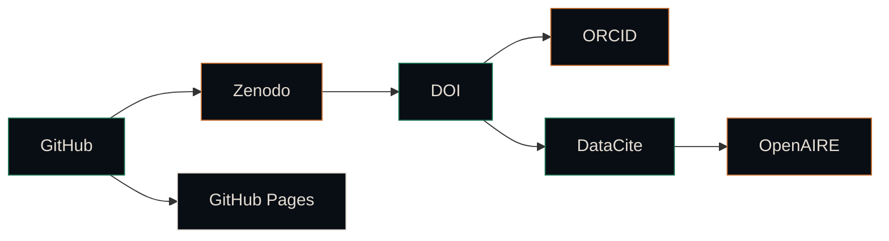

<div align="center">


<br/>

<a href="https://deontewattsv1.github.io/Wildfire-The-Architecture-of-Surrender/">
  
</a>
<a href="https://orcid.org/0009-0005-8586-3650">
  
</a>
<a href="https://doi.org/10.5281/zenodo.20217886">
  
</a>

<br/>


<br/><br/>


<br/>

<strong>README FRONT</strong> → GitHub-safe holographic portal &nbsp; · &nbsp;
<strong>HTML APP</strong> → Full interactive experience &nbsp; · &nbsp;
<strong>CHARACTERS</strong> → Avatar · NPC · Desktop Pet · Shimeji · VTuber-inspired

</div>

---

# Architect's Signal

**Wildfire: The Architecture of Surrender** is a citable research repository and public identity-sync workflow for a theological-poetic manuscript. It treats GitHub as the source of truth, Zenodo as the DOI and archive layer, ORCID as the persistent researcher identity, DataCite/OpenAIRE as metadata propagation infrastructure, and GitHub Pages as the live public interface.

> **Author:** Deonte Watts
> **Research identity:** [https://orcid.org/0009-0005-8586-3650](https://orcid.org/0009-0005-8586-3650)
> **Repository:** [https://github.com/DeontewattsV1/Wildfire-The-Architecture-of-Surrender](https://github.com/DeontewattsV1/Wildfire-The-Architecture-of-Surrender)
> **Live interface:** [https://deontewattsv1.github.io/Wildfire-The-Architecture-of-Surrender/](https://deontewattsv1.github.io/Wildfire-The-Architecture-of-Surrender/)
> **DOI:** [https://doi.org/10.5281/zenodo.20217886](https://doi.org/10.5281/zenodo.20217886)

---

## Launch

<div align="center">

<a href="https://deontewattsv1.github.io/Wildfire-The-Architecture-of-Surrender/">
  
</a>
<a href="docs/index.html">
  
</a>

</div>

---

## What this repository does

| Layer | Purpose | Output |
|---|---|---|
| **Manuscript** | Canonical theological-literary source | `manuscript/main.tex` |
| **Citation** | Human + machine citation metadata | `CITATION.cff`, `.zenodo.json` |
| **Persistent IDs** | DOI/ORCID/DataCite/OpenAIRE alignment | `metadata/` |
| **Frontend** | Public research launch surface | `docs/index.html` |
| **Archive** | Preservation path for long-term access | Zenodo release + DOI |

---

## Quick Stats

<div align="center">


</div>

---

## Interactive feature grid

| Feature | Icon | Description |
|---|:---:|---|
| **iOS glass panels** | :iphone: | Frosted translucent UI in the GitHub Pages app |
| **Holographic overlays** | :sparkles: | Radial gradients, scanlines, spectral glow, copper/forest/cream palette |
| **Moving avatar system** | :space_invader: | Sprite/NPC/desktop-pet style companion that reacts to UI state |
| **Generative canvas** | :art: | Seeded particle field that can be regenerated and exported |
| **Layered HUD** | :tv: | Floating cards, research status panels, identity graph, DOI workflow |
| **Sound toggle** | :loud_sound: | Optional ambient UI tone, created only after user activation |
| **Seed controls** | :seedling: | Reproducible visual state for screenshots and presentations |
| **Theme modes** | :rainbow: | Obsidian, copper, forest, cream, neon |

---

## Character system

| Term | Icon | How it appears in this project |
|---|:---:|---|
| **Avatar** | :bust_in_silhouette: | Visual identity of the research interface and author persona |
| **Sprite** | :ghost: | Animated companion element moving through the HUD |
| **NPC** | :robot: | Guide character explaining the DOI/ORCID workflow |
| **Desktop pet** | :cat: | Small reactive companion that idles, wanders, and responds to clicks |
| **Shimeji-style companion** | :dancer: | Playful browser-adapted screen companion |
| **VTuber-inspired character** | :performing_arts: | Virtual presenter frame for research identity and launch energy |
| **PNGTuber expression states** | :crystal_ball: | Static expression modes triggered by buttons and workflow states |
| **Agent** | :gear: | Software-guided actor that routes metadata, deposits, and citations |
| **HUD** | :satellite: | Floating command-center overlay in the live app |
| **Glassmorphism** | :snowflake: | Frosted-panel visual system |
| **Holographic UI** | :milky_way: | Spectral layered interface built from glow, blur, scanlines, and gradients |

---

## DOI / Archive / Identity-Sync Architecture



---

## Screenshots / Preview

<div align="center">

<a href="https://deontewattsv1.github.io/Wildfire-The-Architecture-of-Surrender/">
  
</a>

</div>

> Visit the live GitHub Pages interface to see the holographic UI, generative canvas, moving avatar system, and layered HUD in action.

---

<details>
<summary><strong>Repository structure</strong></summary>

<br/>

```text
/
├─ README.md
├─ CITATION.cff
├─ .zenodo.json
└─ docs/
   ├─ index.html
   └─ .nojekyll
```

</details>

---

<details>
<summary><strong>GitHub Pages setup</strong></summary>

<br/>

```bash
mkdir -p docs
touch docs/.nojekyll

git add README.md docs/index.html docs/.nojekyll
git commit -m "Add holographic README front and interactive HTML page"
git push origin main
```

Then enable:

```text
Repository Settings → Pages → Deploy from a branch → main → /docs → Save
```

Live URL:

```text
https://deontewattsv1.github.io/Wildfire-The-Architecture-of-Surrender/
```

</details>

---

## DOI release status

The repository is now aligned to the minted DOI:

```text
10.5281/zenodo.20217886
https://doi.org/10.5281/zenodo.20217886
```

Next: add the DOI-backed work to ORCID and keep future GitHub releases synchronized with Zenodo versions.

---

## Citation

Watts, Deonte. (2026). *Wildfire: The Architecture of Surrender*. Canonical Research Repository. https://doi.org/10.5281/zenodo.20217886

```bibtex
@misc{watts2026wildfire,
  author       = {Watts, Deonte},
  title        = {Wildfire: The Architecture of Surrender},
  year         = {2026},
  publisher    = {Canonical Research Repository},
  doi          = {10.5281/zenodo.20217886},
  url          = {https://github.com/DeontewattsV1/Wildfire-The-Architecture-of-Surrender}
}
```

---

<details>
<summary><strong>Advanced customization checklist</strong></summary>

<br/>

- [x] Replace Zenodo DOI placeholder.
- [ ] Confirm final author display name and affiliation.
- [ ] Add a release tag such as `v0.1.0`.
- [ ] Enable GitHub Pages from `/docs`.
- [ ] Add custom domain or Cloudflare route if desired.
- [ ] Add the DOI-backed work to ORCID.
- [ ] Add preview screenshots or GIFs to this README after the live page renders.

</details>

---

## Related Projects

<div align="center">

<a href="https://github.com/DeontewattsV1/Git-Locker-"></a>
<a href="https://github.com/DeontewattsV1/Harmonic-Visual-Environment-Journal-and-HIMM"></a>
<a href="https://github.com/DeontewattsV1/The-Architects-Signal"></a>

</div>

---

<details>
<summary><strong>Support This Project</strong></summary>

<br/>

<div align="center">

[](https://www.patreon.com/cw/GetitD)
[](https://opencollective.com/deontewattsv1)
[](https://ko-fi.com/deontewattsv1)
[](https://sonarcloud.io/organizations/deontewattsv1/)
[](https://crowdfunding.lfx.linuxfoundation.org/deontewattssV1)
[](https://liberapay.com/DeontewattsV1/)
[](https://issuehunt.io/profiles/deontewattsv1)
[](https://polar.sh/dashboard/deonte-watts)
[](https://buymeacoffee.com/deontewattsv1)
[](https://thanks.dev/e/gh/deontewattsv1)

</div>

</details>

---

<div align="center">


<br/>


<strong>GoodShyt × Architect's Signal</strong><br/>
Obsidian · Forest · Copper · Cream · Slate

</div>
